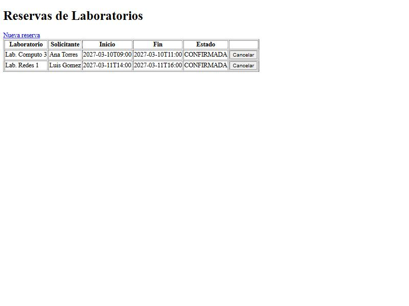
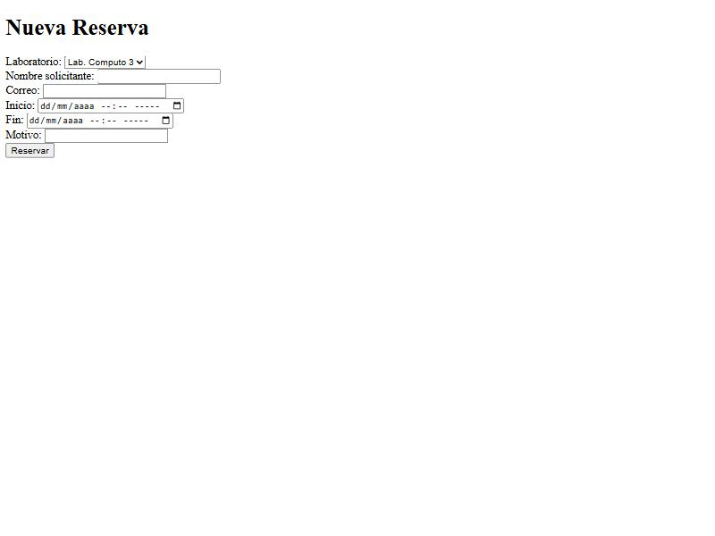
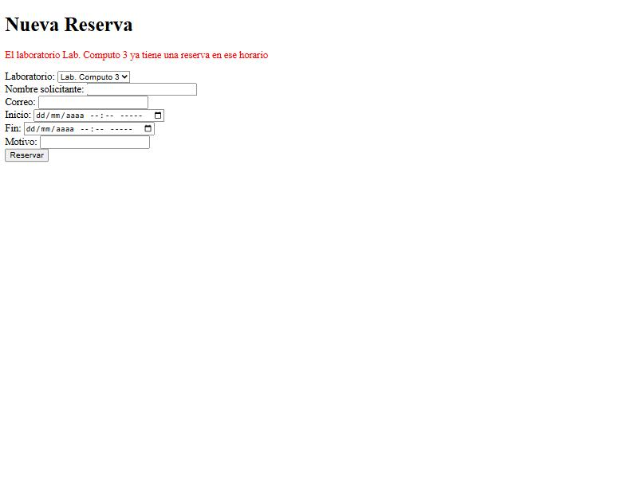

# Post-contenido — Unidad 5: Integración en Aplicaciones Web

## Descripción

Repositorio del post-contenido de la Unidad 5 de Patrones de Diseño
de Software. Un único proyecto Spring Boot (`reservas-labs-api`) para
la reserva de laboratorios de cómputo, con dos partes: una API REST
en capas (Entity, Repository, Service, Controller) sobre H2, y una
vista Thymeleaf (MVC clásico) que reutiliza el mismo Service.

## Estructura del proyecto

```
sanchez-post1-u5/
├── pom.xml
└── src/main/
    ├── java/com/universidad/reservaslabs/
    │   ├── ReservasLabsApiApplication.java   arranque Spring Boot
    │   ├── model/          Laboratorio, Reserva, EstadoReserva (Entity + validación)
    │   ├── repository/     LaboratorioRepository, ReservaRepository (Spring Data JPA)
    │   ├── exception/      ReservaConflictException, RecursoNoEncontradoException,
    │   │                   GlobalRestExceptionHandler (REST → JSON)
    │   ├── service/        ReservaService (reglas de negocio)
    │   ├── controller/     ReservaController, LaboratorioController (REST)
    │   └── web/            ReservaWebController (MVC), ReservaWebExceptionHandler
    └── resources/
        ├── application.properties
        └── templates/reservas/   lista.html, nueva.html (Thymeleaf)
```

## Parte 1 — Repository, Service y Controller REST

`LaboratorioRepository` y `ReservaRepository` extienden `JpaRepository`;
`ReservaRepository` agrega una consulta JPQL propia (`buscarSolapamientos`)
para detectar solapamientos de horario. `ReservaService` concentra las
reglas de negocio (solapamiento, horario de atención, duración,
cancelación tardía). `ReservaController` y `LaboratorioController` exponen
`/api/reservas` y `/api/laboratorios`. Ver paquetes `model/`, `repository/`,
`service/`, `exception/` y `controller/`.

## Parte 2 — Vista MVC con Thymeleaf

`ReservaWebController` expone `/reservas` con Thymeleaf, inyectando la
MISMA instancia de `ReservaService` que usa la API REST — sin Service
duplicado. `ReservaWebExceptionHandler` maneja las mismas excepciones
de dominio que `GlobalRestExceptionHandler`, con presentación distinta
(redirección con mensaje en vez de JSON). Ver paquete `web/` y
`templates/reservas/`.

## Cómo ejecutar

```
$ mvn clean package
$ mvn spring-boot:run
```

- API REST: http://localhost:8080/api/reservas (y `/api/laboratorios`)
- Vista MVC: http://localhost:8080/reservas (y `/reservas/nueva`)
- Consola H2: http://localhost:8080/h2-console

> **Nota de entorno.** El `pom.xml` fija `<java.version>17</java.version>`
> (el enunciado pide Java 17). Como el equipo de pruebas tiene JDK 24
> instalado, se subió `lombok.version` a 1.18.38 (la 1.18.30 por defecto
> no soporta JDK 24) y se declaró Lombok en `annotationProcessorPaths` del
> compiler plugin, porque desde JDK 23 el procesamiento de anotaciones
> presentes solo en el classpath está desactivado por defecto. No se
> agregó ninguna dependencia nueva fuera de las del enunciado (incluida
> `spring-boot-starter-thymeleaf` en la Parte 2).

### Endpoints REST principales

| Método | Ruta | Descripción |
|--------|------|-------------|
| GET | `/api/laboratorios` | Lista el catálogo de laboratorios |
| POST | `/api/laboratorios` | Crea un laboratorio (201) |
| GET | `/api/reservas` | Lista todas las reservas |
| GET | `/api/reservas/{id}` | Obtiene una reserva |
| GET | `/api/reservas/laboratorio/{id}` | Reservas de un laboratorio |
| POST | `/api/reservas` | Crea una reserva (201 / 409 / 400) |
| DELETE | `/api/reservas/{id}` | Cancela una reserva (204) |

### Rutas MVC (Thymeleaf)

| Método | Ruta | Descripción |
|--------|------|-------------|
| GET | `/reservas` | Lista de reservas en HTML |
| GET | `/reservas/nueva` | Formulario de creación |
| POST | `/reservas` | Crea y redirige con mensaje |
| POST | `/reservas/{id}/cancelar` | Cancela y redirige con mensaje |

## Decisiones de diseño

### Punto de decisión 1 — Ubicación de la validación de solapamiento

El **filtrado** de solapamientos (qué reservas chocan con un rango) vive en
una consulta del Repository (`ReservaRepository.buscarSolapamientos`, JPQL
con `@Query`), que lo resuelve en el motor de base de datos. La **decisión
de negocio** —si hay resultados, rechazar lanzando `ReservaConflictException`
con un mensaje claro— vive exclusivamente en `ReservaService.crear(...)`.
El Repository responde una pregunta de *datos* ("¿qué reservas se solapan?");
el Service responde una pregunta de *negocio* ("¿se permite crear esta
reserva?").

La alternativa descartada era traer a memoria todas las reservas del
laboratorio (`findByLaboratorioId`) y comparar rangos con Java puro en el
Service: no escala, porque esa lista crece sin límite con el tiempo.
Y si el **Controller** llamara `buscarSolapamientos()` directamente sin pasar
por el Service, la regla de negocio (cómo interpretar ese resultado, qué
excepción lanzar, con qué mensaje) quedaría en la capa HTTP y habría que
repetirla en cada endpoint y en la vista MVC: justo lo que la capa Service
existe para evitar.

### Punto de decisión 2 — Reglas con y sin apoyo del Repository

La validación de **horario de atención** (07:00–21:00) y de **duración**
(30 min a 3 h) depende únicamente de los campos `inicio` y `fin` de la
propia `Reserva` que se está creando. Por eso `validarHorarioYDuracion`
vive entera en `ReservaService`, en Java puro, sin tocar el Repository ni
la base de datos.

Criterio general: si la regla necesita comparar contra datos que solo la
base de datos conoce (otras reservas existentes) → conviene apoyarse en una
consulta del Repository (como el solapamiento, PD1); si la regla solo
depende del propio objeto que se valida → no hay razón para involucrar al
Repository ni a la BD. Mezclarlos (p. ej. ir a la BD para validar el
horario) solo agregaría acoplamiento y un viaje a datos innecesario.

### Punto de decisión 3 — Cómo comparten Service el Controller MVC y el REST

`ReservaController` (REST, `controller/ReservaController.java:14-15`) y
`ReservaWebController` (MVC, `web/ReservaWebController.java:14-19`) reciben
ambos por constructor la **misma clase** `ReservaService`, que Spring
gestiona como un único bean singleton. Ninguno reimplementa la validación
de solapamiento ni la de horario: las dos superficies (JSON y HTML) se
apoyan en la misma lógica.

La alternativa descartada —copiar la validación dentro de
`ReservaWebController`, o crear un segundo `ReservaWebService` casi idéntico—
obligaría a corregir la regla de solapamiento en dos lugares cada vez que
cambie, con el riesgo de que las dos superficies diverjan. Un solo Service
compartido garantiza que una corrección se aplique a REST y MVC a la vez.

### Punto de decisión 4 — Manejo de errores consistente entre MVC y REST

Se usan **dos manejadores** de excepciones que parten del mismo vocabulario
de dominio (`ReservaConflictException`, `RecursoNoEncontradoException`):

- `GlobalRestExceptionHandler` — `@RestControllerAdvice(annotations =
  RestController.class)` — serializa a JSON con el código HTTP (409, 404, 400).
- `ReservaWebExceptionHandler` — `@ControllerAdvice(assignableTypes =
  ReservaWebController.class)` — redirige a la página con un mensaje flash
  legible en HTML.

No se usa un único `@RestControllerAdvice` global porque siempre serializaría
a JSON, y una página Thymeleaf necesita una redirección con mensaje, no un
cuerpo JSON. La alternativa de un solo manejador que inspeccione el header
`Accept` para decidir el formato añadiría una rama condicional por cada
excepción; en cambio, dos manejadores —cada uno restringido a su tipo de
controlador con `annotations` o `assignableTypes`— mantienen la misma
separación de responsabilidades del resto del proyecto: una clase por
superficie de presentación, ambas alimentadas por las mismas excepciones de
dominio. Verificado: una reserva solapada en `/reservas/nueva` redirige
mostrando el mismo mensaje de negocio que la API REST devuelve como JSON 409.

## Capturas de pantalla

**Vista MVC — lista de reservas (`/reservas`):**



**Vista MVC — formulario de nueva reserva (`/reservas/nueva`):**



**Vista MVC — mismo error de negocio que la API REST (reserva solapada):**
La vista muestra el mensaje "El laboratorio Lab. Computo 3 ya tiene una reserva
en ese horario", idéntico al que la API REST devuelve como JSON con código 409.



## Herramientas utilizadas

- Java 17, Spring Boot 3.2, Spring Data JPA, H2, Thymeleaf
- Apache Maven, Postman/curl, Git, GitHub

## Conclusiones

El laboratorio mostró que una arquitectura en capas no se trata de crear una
capa por plantilla, sino de ubicar cada responsabilidad donde realmente
pertenece: el Repository responde preguntas de datos y el Service decide
reglas de negocio, y por eso `LaboratorioController` puede usar el Repository
directo (catálogo sin reglas) mientras `ReservaController` nunca lo hace. Lo
más difícil fue decidir dónde vive cada regla: la de solapamiento necesita la
base de datos y se apoya en una consulta del Repository, mientras que la de
horario y duración depende solo del objeto y se queda en el Service. La Parte
2 confirmó el valor de esa separación: al reutilizar el mismo `ReservaService`
desde una vista MVC, no hubo que reescribir ni una sola regla, y los mismos
errores de dominio se presentaron de dos formas distintas (JSON y HTML) sin
duplicar lógica. La clave profesional es justificar cada decisión, no seguir
la plantilla de capas de forma mecánica.
